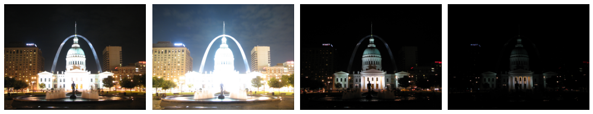
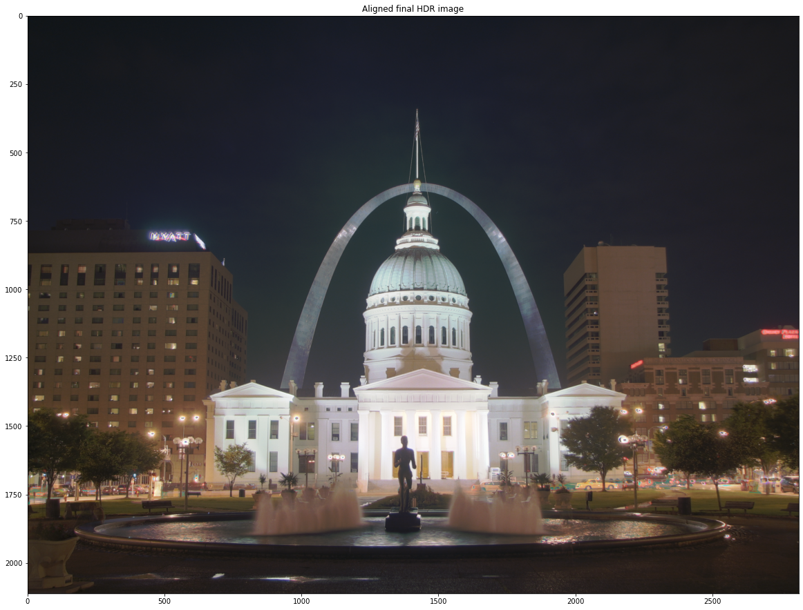

# High-Dynamic Range Imaging (HDR) Using Debevec-Malik Method And Homographic Image Alignment

Modern digital photography and displays uses 24 bits to store image pixel information, where each RGB channel uses 8-bit values from 0-255. These values are not always enough the capture all the detail one may want to capture when photographing real scenes. To get around this a camera will adjust its exposures to capture the highest dynamic range of colors it can and any colors falling outside the range will be clipped. This can result in images having oversaturated and dark regions which result in loss of detail.  A way to get around this is to take multiple images of the same frame in quick succession with no movement at different exposures. These different exposures can then be combined into one image which will have a higher dynamic range of color values and thus more details. This process is called high-dynamic-range imaging or HDR.

In this project, I have implemented the Debevec-Malik Method of generating HDR composite images from multiple different exposures of an image. This method uses know exposure times from each image to combine them. I will present a walkthrough of my implementation of the Debevec-Malik Method where I will show the steps of estimating the radiometric response function, blending pixels from different exposures to create a radiance map, and finally, applying tone mapping algorithms to map the HDR image to a displayable gamut. I will then apply my implementation to multiple sample images and discuss the results. I will also discuss the use of different tone mapping algorithms on the final results. 

The second part of this project will be the implementation of an alignment algorithm using homographies and RANSAC model fitting. This is an important enhancement to my project as HDR algorithms like the Debevec-Malik Method assume that the different exposure images are perfectly aligned. Having an auto-alignment algorithm means I will be able to drop the requirement of using a tripod for multi-exposure shots or needing to find pre-aligned samples. I will discuss some of the unique challenges faced when implementing an alignment algorithm to align images with different exposures. Finally, I will show samples that were processed by the alignment algorithm before using the Debevec-Malik Method to get their HDR composite and compare this to HDR images created using non-aligned images.

## Code libraries
Most libraries used in this project are installed with the default anaconda package. Most of these libraires are common and have been used in previous course assignments these include numpuy matplotlib, and the python math library

Another library used was skimage. This library was used for the alignment of images using its feature detection, and RANSAC implementation. It comes pre installed with the default anaconda package.

The last library used was OpenCV (cv2). It was used for loading and resizing images as well as for some of its reimplemented tone mapping algorithms It **does not** come pre installed with the default anaconda package. To install please type: `conda install -c conda-forge opencv` in the anaconda prompt.

## Instruction for loading images
In order for my software to create the HDR composite it requires a set of images taken at different exposures and then it will combine them. The exposure time of each image must be known. Such an image set can be created using exposure bracketing mode on some advance camera apps like on the *Manual Camera* app on android.

The set of images are expected to be accompanied by an .txt file containing the list of file names of all images belonging to the set, along with their exposure times. The format of the file is expected to be the image file name and exposure time separated by a space, with each image record being on a new line. When making this list one can find the exposure time for most images in their metadata which can be viewed on Windows in the *Details* tab of the *properties* window for each image.

All images to be processed and the *image_list* txt file  should put in the image folder. Which by default is assumed to be a subfolder of the folder where this notebook is located. The location of this directory should be found can be changed by changing the *IMG_FOLDER* path variable at the top of this notebook. Similarly, the location where the final HDR images will be saved can also be changed by editing the *RESULTS_FOLDER* variable.

## Sample results
To see all results and code see *HDR project* workbook

### Before: 
)
### After:
)